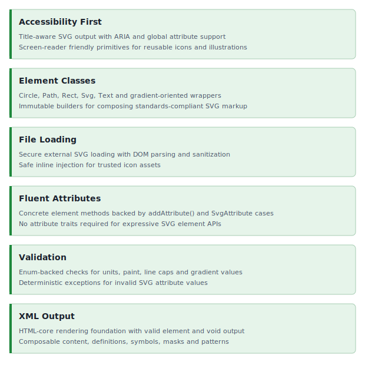

<!-- markdownlint-disable MD041 -->
<p align="center">
    <picture>
        <source media="(prefers-color-scheme: dark)" srcset="https://raw.githubusercontent.com/ui-awesome/.github/refs/heads/main/logo/ui_awesome_dark.png">
        <source media="(prefers-color-scheme: light)" srcset="https://raw.githubusercontent.com/ui-awesome/.github/refs/heads/main/logo/ui_awesome_light.png">
        
    </picture>
    <h1 align="center">Html SVG</h1>
    <br>
</p>
<!-- markdownlint-enable MD041 -->

<p align="center">
    <a href="https://github.com/ui-awesome/html-svg/actions/workflows/build.yml" target="_blank">
        
    </a>
    <a href="https://dashboard.stryker-mutator.io/reports/github.com/ui-awesome/html-svg/main" target="_blank">
        
    </a>
    <a href="https://github.com/ui-awesome/html-svg/actions/workflows/static.yml" target="_blank">
        
    </a>
</p>

<p align="center">
    <strong>A robust, fluent, and immutable PHP library for generating and manipulating SVG elements.</strong><br>
    <em>Secure file loading, accessibility-first design, and standards-compliant rendering.</em>
</p>

## Features

<picture>
    <source media="(min-width: 768px)" srcset="./docs/svgs/features.svg">
    
</picture>

### Installation

```bash
composer require ui-awesome/html-svg:^0.3
```

### Quick start

This library provides an immutable, fluent API for generating SVG markup in PHP.

It supports composing SVG elements using wrapper classes, secure SVG loading from the filesystem, and accessibility-first rendering.

#### Power example: Gradients + composition + immutability

```php
use UIAwesome\Html\Svg\{Circle, Defs, LinearGradient, Stop, Svg};

$stops = Stop::tag()->offset('0%')->stopColor('#16a34a')->stopOpacity(1)->render()
    . PHP_EOL
    . Stop::tag()->offset('100%')->stopColor('#22c55e')->stopOpacity(1)->render();

$gradient = LinearGradient::tag()
    ->id('accent')
    ->x1('0%')->y1('0%')->x2('100%')->y2('0%')
    ->content($stops);

$defs = Defs::tag()->content($gradient->render());

$baseCircle = Circle::tag()
    ->cx(60)->cy(60)->r(46)
    ->stroke('#064e3b')->strokeWidth(3);

// Immutable: each setter returns a new instance.
$primary = $baseCircle->fill('url(#accent)');
$ghost = $baseCircle->fill('none')->opacity(0.25)->transform('translate(6 6)');

echo Svg::tag()
    ->xmlns('http://www.w3.org/2000/svg')
    ->viewBox('0 0 120 120')
    ->width(120)->height(120)
    ->title('Gradient badge example')
    ->content(
        $defs->render()
        . PHP_EOL
        . $ghost->render()
        . PHP_EOL
        . $primary->render(),
    )
    ->render();
```

#### Real-world example: Yii icon (inline)

```php
use UIAwesome\Html\Svg\{Path, Svg};

$yiiPath = 'M17.8797 0c-.8433.5448-1.8054 1.509-2.3626 2.3403-1.1685 1.7424-1.4392 2.9943-.8005 4.8628.2165.6336.5761 1.2934.8362 1.873 1.0218 2.2778 2.0625 4.3279 1.8107 7.285 2.1603-2.7611 3.0147-3.8864 3.9253-6.57C22.54 6.1032 21.282 2.1322 17.8798 0M5.6417 4.6556c-1.1433.01-2.2877.2206-3.3819.6593-.2107 2.6576 1.0216 7.2303 5.5165 8.5057 1.8172.559 3.2721.4139 5.0555.8988v.0002c-.5755 1.016-1.4105 1.988-1.9082 2.9732-.4934.9764-.585 1.9434-.5391 3.0428.0462 1.1054.3017 2.1896.547 3.2644.9242-.1994 1.7287-.5405 2.4247-.9767 1.8315-1.1483 2.9383-2.9849 3.2528-4.9635 0 0 .0085-.0674.0153-.1245 0 .0057.0005.0114.0003.0171l.0054-.0617c.0003-.0049.0007-.004.001-.009.0055-.0583.0089-.1053.0137-.1605.0108-.123.0218-.2471.03-.3564.0023-.0285.0035-.0521.0055-.0797.0085-.1166.0171-.2335.023-.3358l.0014-.0338.0003-.003c.0006-.0115.0006-.0204.0013-.0318a15 15 0 0 0 .0147-.34c.003-.1062.005-.2063.0052-.2979l-.0002-.0115v-.0058a9 9 0 0 0-.0139-.5081c-.0088-.158-.0207-.3053-.0325-.4612-.081-1.0689-.2939-1.9498-.5285-2.6617a12 12 0 0 0-.1782-.5023v-.0002c-.179-.4714-.3545-.8502-.4805-1.1447a7.4 7.4 0 0 0-.2747-.5688 10 10 0 0 0-.1423-.2573c-.233-.407-.4347-.6938-.435-.6931l-.1231-.1832c-2.0257-2.8436-5.4458-4.6194-8.8755-4.5893';

echo Svg::tag()
    ->xmlns('http://www.w3.org/2000/svg')
    ->viewBox('0 0 24 24')
    ->title('Yii')
    ->content(
        Path::tag()->d($yiiPath)->fill('currentColor')->render(),
    )
    ->render();
```

#### Loading from file (secure)

```php
use UIAwesome\Html\Svg\Svg;

// Loads, sanitizes, and injects an external SVG file.
echo Svg::tag()
    ->class('icon-lg')
    ->filePath('/path/to/icon.svg')
    ->fill('currentColor')
    ->title('Icon')
    ->render();
```

Note: If both the internal `content` and `filePath()` are empty, an exception is thrown.

## Documentation

For detailed configuration options and advanced usage.

- [Testing Guide](docs/testing.md)

## Package information

[](https://www.php.net/releases/8.1/en.php)
[](https://packagist.org/packages/ui-awesome/html-svg)
[](https://packagist.org/packages/ui-awesome/html-svg)

## Quality code

[](https://codecov.io/github/ui-awesome/html-svg)
[](https://github.com/ui-awesome/html-svg/actions/workflows/static.yml)
[](https://github.com/ui-awesome/html-svg/actions/workflows/linter.yml)
[](https://github.styleci.io/repos/776094320?branch=main)

## Our social networks

[](https://x.com/Terabytesoftw)

## License

[](LICENSE)
